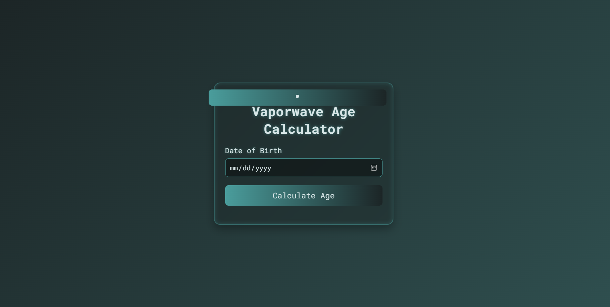
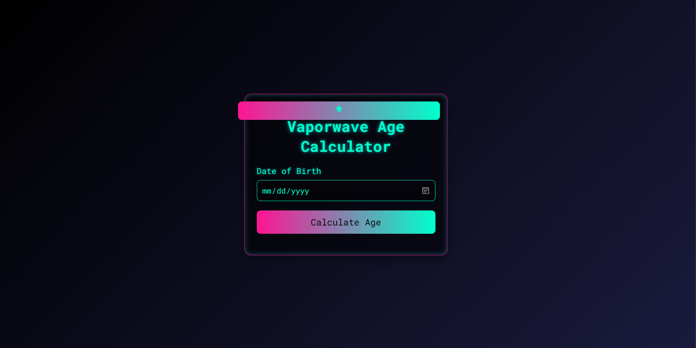
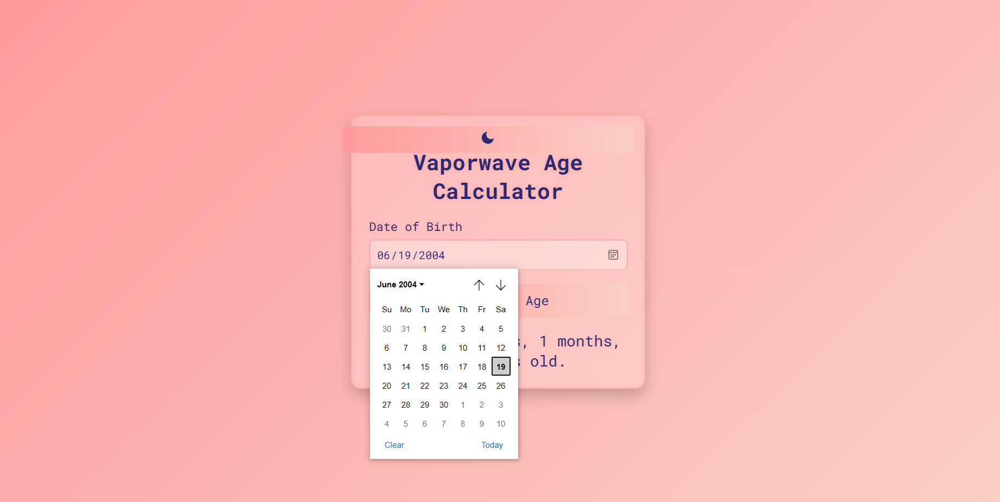

# Vaporwave Age Calculator

A web-based age calculator with a unique vaporwave-inspired UI, featuring a three-theme system (Vaporwave, Neon, Dark), built using HTML, CSS, and JavaScript. Users can input their date of birth via a native calendar picker and view their age in years, months, and days. The application offers a dreamy pastel default theme (Vaporwave), a vibrant neon theme, and a muted dark theme, with smooth 3D animations and glowing effects for a standout look.

## 📸 Preview







---

## Features

- **Date Input**: Native HTML5 `<input type="date">` for an intuitive calendar picker to select the date of birth.
- **Age Calculation**: Accurately computes age in years, months, and days using JavaScript's `Date` object.
- **Input Validation**: Ensures valid dates, prevents future dates, and displays glowing error messages.
- **Three Themes**:
  - **Vaporwave (Default)**: Pastel-colored, dreamy design with translucent elements and pink glows.
  - **Neon**: Vibrant cyan and pink palette with intense glowing effects and a futuristic vibe.
  - **Dark**: Muted navy and teal palette for a sleek, understated look.
- **Theme Switching**: Cycle through Vaporwave, Neon, and Dark themes with `localStorage` persistence.
- **Responsive Design**: Optimized for desktop and mobile with smooth animations and transitions.
- **Unique Animations**: Includes 3D floating effects and button shine animations for a distinctive aesthetic.

## Installation

To run the project locally:

1. **Clone the Repository**:
   ```bash
   git clone https://github.com/mwaqasdev/vaporwave-age-calculator.git
   ```
2. **Navigate to the Project Directory**:
   ```bash
   cd vaporwave-age-calculator
   ```
3. **Open the Application**:
   - Open `index.html` in a web browser (e.g., Chrome, Firefox) directly.
   - Alternatively, use a local development server (e.g., VS Code's Live Server or `npx http-server`).

## Usage

1. Open the application in a web browser.
2. Click the "Date of Birth" field to open the calendar picker and select your birth date (must be on or before July 23, 2025).
3. Click "Calculate Age" to view your age in years, months, and days.
4. Click the theme toggle button to cycle through Vaporwave (moon icon), Neon (star icon), and Dark (sun icon) themes. The theme persists across sessions.
5. Invalid inputs display error messages in red with a glowing effect.

## Technologies Used

- **HTML5**: For the structure and native date input.
- **CSS**: For custom styling, animations, and theme switching.
- **JavaScript**: For age calculation, input validation, and theme toggling.
- **Google Fonts (Roboto Mono)**: For a sleek, retro-modern typography.

## Project Structure

```
vaporwave-age-calculator/
├── index.html  
├── style.css
├── script.js       
├── README.md    
```

## Contributing

Contributions are welcome! To contribute:

1. Fork the repository.
2. Create a new branch (`git checkout -b feature/your-feature`).
3. Make your changes and commit (`git commit -m "Add your feature"`).
4. Push to the branch (`git push origin feature/your-feature`).
5. Open a pull request with a clear description of your changes.

Please ensure your code follows the existing style and includes comments where necessary.

## License

This project is licensed under the MIT License. See the [LICENSE](LICENSE) file for details.

## Acknowledgments

- Inspired by vaporwave and neon aesthetics with pastel and glowing visuals.
- Built with [Google Fonts](https://fonts.google.com/) for the Roboto Mono font.
- Created to meet the requirements of a unique, standout UI for an age calculator.